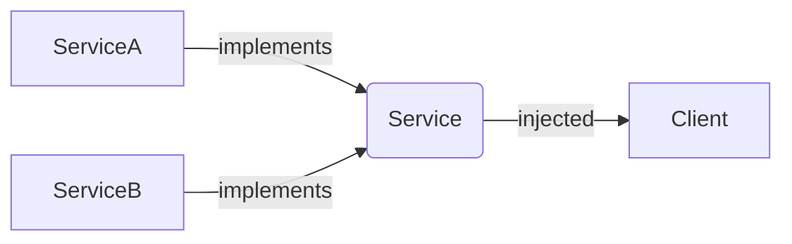

import { Tabs, Tab } from 'nextra/components'

# Prefer Dependency Injection over Explicit Import



## Context

Using explicit imports can lead to tightly coupled and less maintainable code, as the importing module becomes directly dependent on the imported module. This strong dependency can obfuscate the interactions between components, making them less modular and harder to test, understand, and refactor.

## Opinion

Given the context, we prefer using Dependency Injection over explicit import. Dependency Injection allows for the inversion of control, wherein the dependencies of a component are 'injected' by an external entity, rather than being created by the component itself. This approach promotes decoupling between components, enhancing code maintainability, testability, and readability.

## How to Implement

<Tabs items={['Rust', 'Typescript']}>
<Tab>
```rust
trait Service {
  fn hello(&self) -> String;
}

struct Client {
  service: Box<dyn Service>,
}

struct SomeService;

impl Service for SomeService {
  fn hello(&self) -> String {
    "Hello World!".to_string()
  }
}

fn main() {
  let service = Box::new(SomeService);
  let client = Client { service };
}
```
</Tab>

<Tab>
```ts
type Service = {
  hello: () => string
}

type Client = {
  service: Service
}

const service: Service = {
  hello: () => 'Hello World!'
}

const client: Client = {
  service
}

```
</Tab>
</Tabs>
