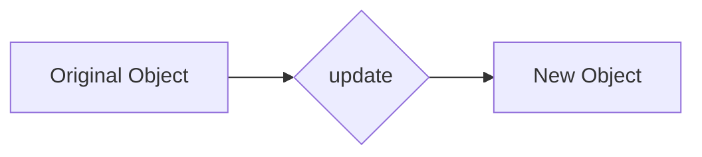

import { Callout, Tabs, Tab } from 'nextra/components'

<Callout type="warning" emoji="⚠️">
  This opinion is suspected to be incorrect. Further performance checks to be done.
</Callout>

# Using Immutability over Mutability



## Context

During software development, a key decision is choosing between immutable and mutable variables. Immutable variables, once created, remain unchanged, while mutable ones can be altered post-creation. OOP languages like Java and C# default to mutable variables, whereas functional languages like Haskell and Scala favor immutability.

## Opinion

Preferring immutability often yields more predictable and maintainable code by minimizing unexpected side effects and simplifying debugging.

## How to Implement

<Tabs items={['Rust', 'Typescript']}>
<Tab>
```rust
struct Point {
  x: i32,
  y: i32,
}

impl Point {
  // Create a new Point with updated x value, without mutating the original
  fn set_x(&self, new_x: i32) -> Point {
    Point {
      x: new_x,
      y: self.y,
    }
  }
  fn set_y(&self, new_y: i32) -> Point {
    Point {
      x: self.x,
      y: new_y,
    }
  }
}
```
</Tab>
<Tab>
```ts
type Point = {
  // We use the readonly keyword to make sure the properties are immutable
  readonly x: number;
  readonly y: number;
}

// We create a new object with the same properties, but with a different value for x
const Point = {
  setX: (point: Point, x: number): Point => ({ ...point, x }),
  setY: (point: Point, y: number): Point => ({ ...point, y }),
}
```
</Tab>
</Tabs>

## Performance Check

<Tabs items={['Rust', 'Typescript']}>
<Tab>
```rust
use std::time::Instant;

fn mutable_simulation() {
  let start = Instant::now();

  let mut user = User { name: String::from("John") };

  for i in 0..1_000_000 {
    if i % 2 == 0 {
      user.name = String::from("John");
    } else {
      user.name = String::from("Jane");
    }
  }

  let duration = start.elapsed();
  println!("Time elapsed in mutable operation is: {:?}", duration);
}

fn immutable_simulation() {
  let start = Instant::now();

  let mut user = User { name: String::from("John") };

  for i in 0..1_000_000 {
    if i % 2 == 0 {
      user = User { name: String::from("John") };
    } else {
      user = User { name: String::from("Jane") };
    }
  }

  let duration = start.elapsed();
  println!("Time elapsed in immutable operation is: {:?}", duration);
}

#[derive(Debug)]
struct User {
  name: String,
}

fn main() {
  mutable_simulation();
  immutable_simulation();
}

/**
 * Time elapsed in mutable operation is: 150.991897ms
 * Time elapsed in immutable operation is: 137.375402ms
 */
```
</Tab>
<Tab>
```ts
const { performance } = require('perf_hooks');

function mutableSimulation() {
  const start = performance.now();

  const user = {
  name: 'John',
  };

  for (let i = 0; i < 1_000_000; i++) {
  if (i % 2 === 0) {
    user.name = 'John';
  } else {
    user.name = 'Jane';
  }
  }

  const duration = performance.now() - start;
  console.log(`Time elapsed in mutable operation is: ${duration} ms`);
}

function immutableSimulation() {
  const start = performance.now();

  let user = {
  name: 'John',
  };

  for (let i = 0; i < 1_000_000; i++) {
  if (i % 2 === 0) {
    user = {
    name: 'John',
    };
  } else {
    user = {
    name: 'Jane',
    };
  }
  }

  const duration = performance.now() - start;
  console.log(`Time elapsed in immutable operation is: ${duration} ms`);
}

mutableSimulation();
immutableSimulation();

/**
 * Time elapsed in mutable operation is: 2.7600000000020373 ms
 * Time elapsed in immutable operation is: 2.470000000001164 ms
 */
```
</Tab>
</Tabs>
