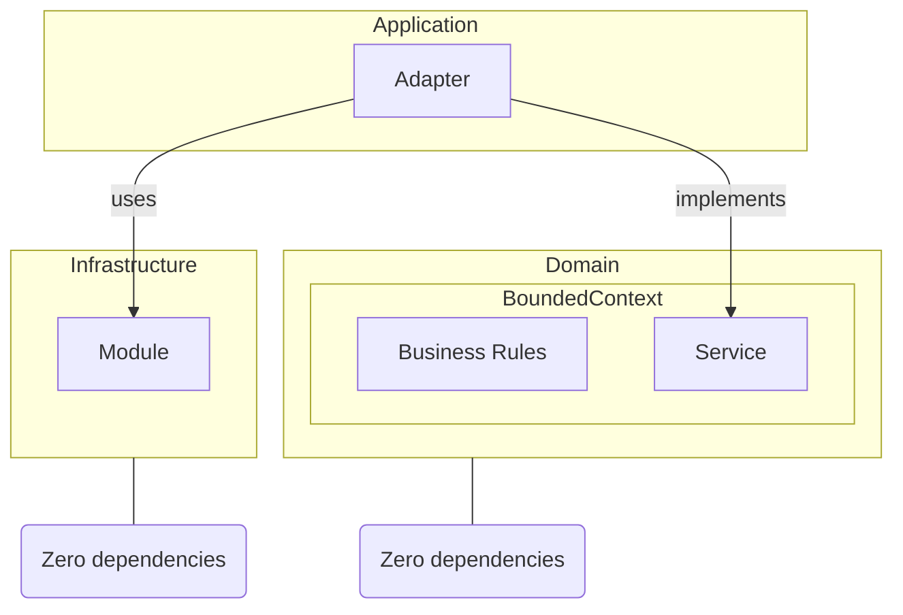

import { Callout, Tabs, Tab } from 'nextra/components'

# The Hexagonal Approach: Structuring Software for Scalability and Maintainability

## Domain Layer

- The **Domain** is composed by multiple **Bounded Contexts**. 
- **Bounded Contexts** do not depend on anything else in the system.
- If a **Bounded Context** needs to use something from another **Bounded Context**, it must be done through the **Application** layer.
- When a customer explains how he does something, he is explaining the **Business Rules**.
- There is no need to prefix anything in the **BoundedContext** because it is strongly independent from the rest. No need to have `UserCreate` and `OrganizationCreate`, just `Create` in their respective **Bounded Contexts**.

## Application Layer

- The **Application** layer is responsible for orchestrating the **Domain** layer with the **Infrastructure layer.
- It must have as little logic as possible.

## Infrastructure Layer

- The **Infrastructure** layer is responsible for all the external dependencies of the system.
- It has no knowledge of the **Domain** layer nor the **Application** layer.
- It can be made of open-source libraries, third-party libraries, databases, etc.
