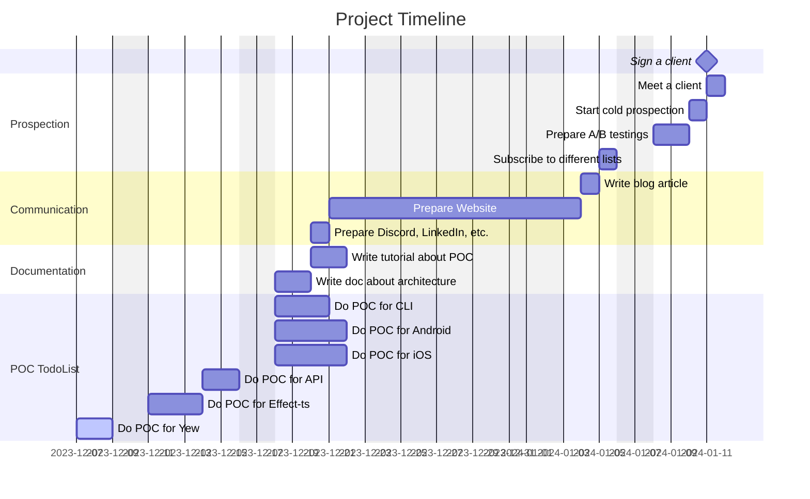

```mermaid
gantt
    dateFormat  YYYY-MM-DD
    title       Project Timeline
    excludes    weekends, 2023-12-25, 2023-12-26, 2023-12-27, 2023-12-28, 2023-12-29, 2023-12-30, 2023-12-31, 2024-01-01, 2024-01-02

    Sign a client                    :milestone, after prosp3, 0d

    section Prospection
    Meet a client                    :prosp4, after prosp3, 1d
    Start cold prospection           :prosp3, after prosp2, 1d
    Prepare A/B testings             :prosp2, after prosp1, 2d
    Subscribe to different lists     :prosp1, after comm3, 1d

    section Communication
    Write blog article              :comm3, after comm2, 1d
    Prepare Website                 :comm2, after comm1, 3d
    Prepare Discord, LinkedIn, etc. :comm1, after doc1, 1d

    section Documentation
    Write tutorial about POC :doc2, after doc1, 2d
    Write doc about architecture :doc1, after pocapi, 2d

    section POC TodoList
    Do POC for CLI         :poccli, after pocapi, 3d
    Do POC for Android     :pocandroid, after pocapi, 4d
    Do POC for iOS         :pocios, after pocapi, 4d
    Do POC for API         :pocapi, after poceffect, 2d
    Do POC for Effect-ts   :poceffect, after pocyew, 3d
    Do POC for Yew         :active, pocyew, 2023-12-07, 2d
```
