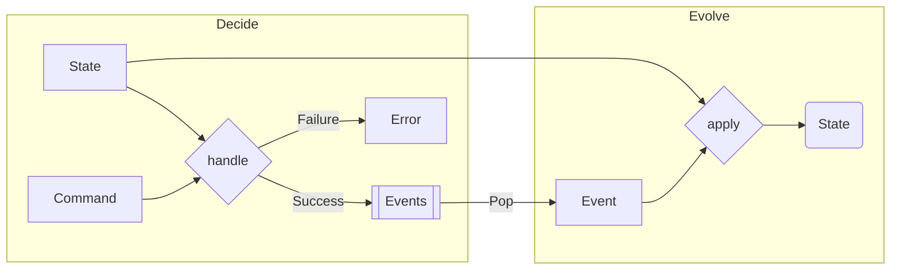

import { Tabs, Tab } from 'nextra/components'

# Choosing Event Sourcing over State Mutation for Persistence



## Context

In traditional state mutation for persistence, the system’s state is directly updated and overwritten in the data store. This makes it challenging to reconstruct past states or understand the history and reasons behind state changes. In contrast, event sourcing persists the state of a business entity as a sequence of state-changing events.

## Opinion

We advocate for using event sourcing as a persistence method over state mutation, as it offers enhanced traceability, auditability, and flexibility. With event sourcing, each state change is stored as a separate event, allowing for a comprehensive history of state transformations, easy debugging, and complex business logic support.

## How to Implement

<Tabs items={['Rust', 'Typescript']}>
<Tab>
```rust
#[derive(Debug, Clone)]
enum AccountEvent {
  Deposited(u64),
  Withdrawn(u64),
}

#[derive(Debug, Clone)]
struct Account {
  balance: u64,
  changes: Vec<AccountEvent>,
}

impl Account {
  fn new() -> Self {
    Account {
      balance: 0,
      changes: Vec::new(),
    }
  }

  // Decision function: Decides what event should occur based on the action
  fn decide(&self, action: &str, amount: u64) -> Result<AccountEvent, &'static str> {
    match action {
      "withdraw" if self.balance < amount => Err("Insufficient funds"),
      "withdraw" => Ok(AccountEvent::Withdrawn(amount)),
      "deposit" => Ok(AccountEvent::Deposited(amount)),
      _ => Err("Invalid action"),
    }
  }

  // Evolution function: Evolves the state based on the event
  fn evolve(self, event: AccountEvent) -> Self {
    let mut new_changes = self.changes.clone();
    new_changes.push(event.clone());

    let new_balance = match event {
      AccountEvent::Deposited(amount) => self.balance + amount,
      AccountEvent::Withdrawn(amount) => self.balance - amount,
    };

    Account {
      balance: new_balance,
      changes: new_changes,
    }
  }

  fn handle_action(self, action: &str, amount: u64) -> Result<Self, &'static str> {
    let event = self.decide(action, amount)?;
    Ok(self.evolve(event))
  }
}

fn main() {
  let account = Account::new();
  let account = account.handle_action("deposit", 100).unwrap();
  let account = account.handle_action("withdraw", 50).unwrap();

  println!("{:?}", account.changes);
}
```
</Tab>
<Tab>
```ts
type AccountEvent = { type: 'Deposited', amount: number } | { type: 'Withdrawn', amount: number };

type Account = {
  balance: number;
  changes: AccountEvent[];
};

// Function to create a new account
const createAccount = (): Account => ({
  balance: 0,
  changes: [],
});

// Decision Function: Determines the appropriate event for an action
const decide = (account: Account, action: 'deposit' | 'withdraw', amount: number): AccountEvent | string => {
  if (action === 'withdraw' && account.balance < amount) return 'Insufficient funds';
  return { type: action.charAt(0).toUpperCase() + action.slice(1) as 'Deposited' | 'Withdrawn', amount };
};

// Evolution Function: Evolves the state of the account based on an event
const evolve = (account: Account, event: AccountEvent): Account => {
  const newBalance = event.type === 'Deposited' ? account.balance + event.amount : account.balance - event.amount;
  return {
    balance: newBalance,
    changes: [...account.changes, event],
  };
};

// Handle Action: Handles an action and evolves the state of the account
const handleAction = (account: Account, action: 'deposit' | 'withdraw', amount: number): Account | string => {
  const eventOrError = decide(account, action, amount);
  if (typeof eventOrError === 'string') return eventOrError;
  return evolve(account, eventOrError);
};

// Example usage:
let account = createAccount();
account = handleAction(account, 'deposit', 100) as Account;
account = handleAction(account, 'withdraw', 50) as Account;

console.log(account.changes);
```
</Tab>
</Tabs>
