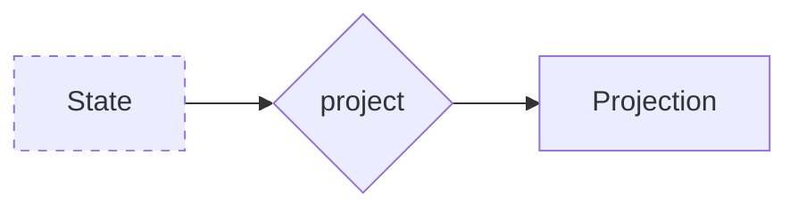

import { Tabs, Tab } from 'nextra/components'

# Projections



Projections are used to create read models or views from the series of events or state changes that occur in the system. The role of a projection is to transform a state into a more readable or convenient format, often optimized for queries.

- **Data Transformation**: Projections transform event-sourced data (state changes) into a format suitable for querying and display.
- **Read Optimization**: They create read models optimized for performance and specific use cases.


## Implementation of Projections

<Tabs items={['Rust']}>
<Tab>
```rust filename="application/projections.rs"
#[derive(Clone, Default, Debug, Serialize, Deserialize)]
pub struct MonthlyBalanceProjection {
    pub id: String,
    pub month: u32,
    pub year: u32,
    pub balance: f64,
}
```
</Tab>
</Tabs>
