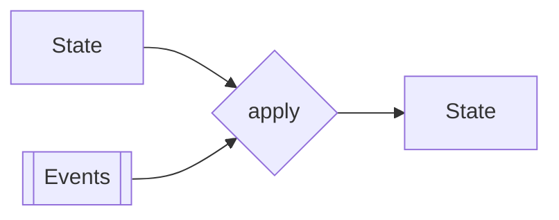

import { Tabs, Tab } from 'nextra/components'

# Events



In traditional state mutation for persistence, the system's state is directly updated and overwritten in the data store. This makes it challenging to reconstruct past states or understand the history and reasons behind state changes. In contrast, event sourcing persists the state of a business entity as a sequence of state-changing events. Each state change is stored as a separate event, allowing for a comprehensive history of state transformations, easy debugging, and complex business logic support. 

- **Auditability**: Records every change, ensuring full traceability.
- **Replayability**: Enables state reconstruction, aiding in debugging and analysis.
- **Scalability**: Efficiently manages high loads through decoupling.
- **Resilience**: Recovers state post-failure from the event log.
- **Insightful Data**: Offers deep insights through historical analysis.
- **Real-World Alignment**: Domain events mirror real-life business processes.

## Creating Events

Events should be the representation of real domain events. You should define them by talking to a domain expert or using techniques like [event storming](https://en.wikipedia.org/wiki/Event_storming). In our banking example, an event could be a deposit or a withdrawal. 

<Tabs items={['Rust', 'Typescript']}>
<Tab>
```rust filename="domain/bankaccount_event.ts"
enum BankAccountEvent {
  Deposited(Amount),
  Withdrawn(Amount),
}

struct Amount(f64);
```
</Tab>
<Tab>
```ts filename="domain/BankAccountEvent.ts"
export type BankAccountEvent = 
  | { _tag: 'AmountDeposited', amount: Amount } 
  | { _tag: 'AmountWithdrawn', amount: Amount };

export type Amount = number & { _tag: 'Amount' };
```
</Tab>
</Tabs>

## Serializing Events

Because events will be stored in a database, they should be serializable. In Rust, you can use the `serde` crate to derive the `Serialize` and `Deserialize` traits.

<Tabs items={['Rust', 'Typescript']}>
<Tab>
```rust filename="domain/bankaccount_event.ts"
use serde::{Serialize, Deserialize};

#[derive(Debug, Serialize, Deserialize)]
enum BankAccountEvent {
  ...
}

```
</Tab>
<Tab>
TODO: zod vs Effect.Schema vs io-ts vs typia
</Tab>
</Tabs>

## Computing States

You can build a new state by applying a sequence of events to an initial state. This is called event replay. **This process cannot fail**, as the events are immutable and cannot be changed. Thus, you should not change the events after they have been created. If you really need to, you can do event upcasting, which is a process of converting an event to a new version of the event or migrating existing data to the new model.


<Tabs items={['Rust', 'Typescript']}>
<Tab>
```rust filename="domain/bankaccount_event.ts"
use framework::*;

impl Events<BankAccount> for Vec<BankAccountEvent> {
  fn apply(&self, &mut state: BankAccount) {
    for event in self {
      match event {
        BankAccountEvent::Deposited(amount) => state.balance += amount,
        BankAccountEvent::Withdrawn(amount) => state.balance -= amount,
      }
    }
  }
}
```
</Tab>
<Tab>
```ts filename="domain/BankAccountEvent.ts"
export const BankAccountEvent = {
  apply: (state: Account) => (events: readonly BankAccountEvent[]) => {
    for (const event of events) {
      switch (event._tag) {
        case 'Deposited':
          state.balance += event.amount;
          break;
        case 'Withdrawn':
          state.balance -= event.amount;
          break;
      }
    }
  }
}
```
</Tab>
</Tabs>
