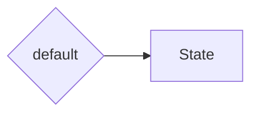

import { Tabs, Tab } from 'nextra/components'

# States



A **State** is a representation of a domain-specific object at a certain time. It should be a pure data structure, with no logic or behavior. It should be able to have a default implementation, which is the initial value. It is okay to have placeholder values for the default implementation. You can also use `Option<T>` to represent a value that is not yet available.

- **Structure**: Primarily a straightforward object, characterized by its properties and data fields.
- **Evolution**: Capable of evolving over time with [events](events.mdx).
- **Non-Public Exposure**: Not intended for public access, hence capable of holding sensitive information.
- **Flexibility**: Adaptable in representing a wide range of domain-specific scenarios.
- **Meaningful**: its name and properties are intentionally descriptive and relevant to its domain.

## Creating States

We want to represent a bank account for a very simple banking application. A bank account has a balance, a description, and an owner. We will use the exact same words to have a loyal representation of the domain.

<Tabs items={['Rust', 'Typescript']}>
<Tab>
```rust filename="domain/account.rs"
#[derive(Default, Debug)]
pub struct BankAccount {
    pub balance: f64,
    pub description: String,
    pub owner: Option<String>
}
```
</Tab>
<Tab>
```typescript filename="domain/Account.ts"
import { Option } from 'effect';

export type BankAccount = {
    balance: number;
    description: string;
    owner: Option<string>;
}

export const BankAccount = {
    default: (): BankAccount => ({
        balance: 0,
        description: '',
        owner: Option.none(),
    }),
}
```
</Tab>
</Tabs>

## Using Newtypes

It is recommended to use newtypes to represent domain-specific values. This will help you to avoid mixing up values of the same type. For example, a bank account balance is a `f64`, but a transaction amount is also a `f64`. If you use the same type for both, you might end up adding a transaction amount to a bank account balance, which is not what you want. We might also want our balance to have only two decimal places, so we can use a newtype to represent it.

<Tabs items={['Rust', 'Typescript']}>
<Tab>
```rust filename="domain/bankaccount.rs"
#[derive(Default, Debug)]
pub struct Account {
    pub balance: Balance,
}

#[derive(Default, Debug)]
pub struct Balance(f64);

impl Balance {
    pub fn parse(value: f64) -> Self {
        let value = (value * 100.0).round() / 100.0;
        Self(value)
    }
}
```
</Tab>

<Tab>
```typescript filename="domain/BankAccount.ts"
export type Account = {
    balance: Balance,
}

export const Account = {
    default: (): Account => ({
        balance: Balance.default(),
    }),
}

export type Balance = number & { _tag: 'Balance' };

export const Balance = {
    default: () => Balance.parse(0),

    parse: (value: number): Balance => Math.round(value * 100) / 100 as Balance,
}
```
</Tab>
</Tabs>
