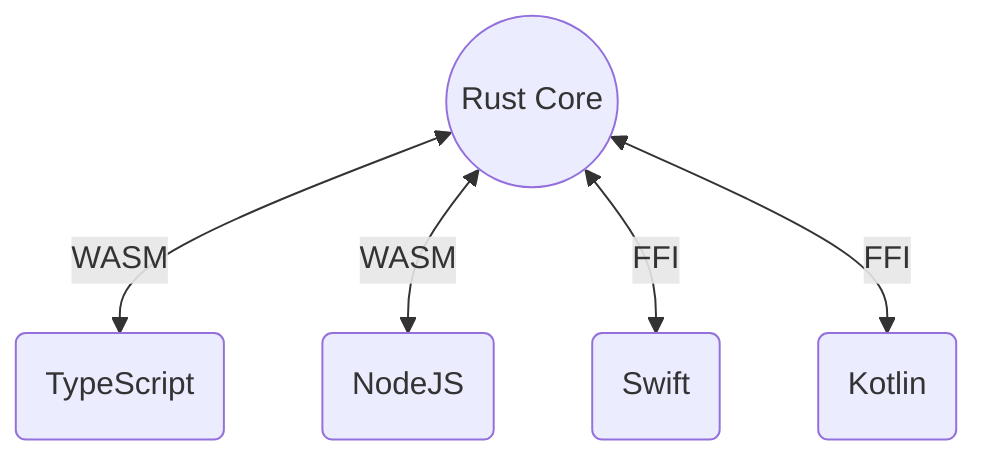

import { Animation, Jumbotron, Hero, Highlight } from "components"

<Animation />

<Jumbotron>

# Forgen

Crafting Multi-Platform Solutions.

</Jumbotron>

<Hero>
<Hero.Primary>
## Multi-Platform Solution

Our Rust core, augmented with bindings to JavaScript, Swift, and Kotlin, enables a <Highlight>code once, deploy everywhere</Highlight> philosophy. Experience unparalleled performance across all platforms.

[Our Studio](/en/studio)

</Hero.Primary>
<Hero.Secondary>

</Hero.Secondary>
</Hero>

<Hero>
<Hero.Secondary>

</Hero.Secondary>
<Hero.Primary>
## Cutting-Edge Technology

Leveraging the latest advancements in Rust, WebAssembly, and TypeScript, we offer unmatched performance and stability. Our commitment to modern technologies ensures scalability and a bug-free experience for your projects.

[Our GitHub](https://github.com/forgen-org)

</Hero.Primary>
</Hero>

<Hero right>
<Hero.Primary>
## Craftsmanship and Quality

Our passion for excellence drives us. Composed solely of senior developers, Forgen is synonymous with craftsmanship. We deliver the highest quality software, meticulously engineered to meet your exact needs.

[Our Architecture](/en/learn/introduction)

</Hero.Primary>
<Hero.Secondary>

</Hero.Secondary>
</Hero>

<Hero>
<Hero.Secondary>

</Hero.Secondary>
<Hero.Primary>
## Our Manifesto

We adhere to a strict set of moral values. Honesty, transparency, and a commitment to quality define us. We reserve the right to choose projects that align with our manifesto, ensuring our work reflects our high ethical standards.

[Read more](/en/manifesto)

</Hero.Primary>
</Hero>

<Hero right>
<Hero.Primary>
## Community and Openness

Forgen is more than a company; we are a community. Our commitment to openness and sharing knowledge is unwavering. From open-source contributions to engaging discussions on our Discord channel and insightful blog articles, we believe in the strength of transparency.

[Join us on Discord](https://discord.gg/6fTK3ssg)

</Hero.Primary>
<Hero.Secondary>

</Hero.Secondary>
</Hero>
