import { Tabs } from "nextra/components"

# Commands

```mermaid
flowchart LR
  Command
  Nothing["∅"]
  Error
  execute{execute}

  Command --> execute
  execute --Ok--> Nothing
  execute --Err--> Error
```



Commands describe an intent to change the system's state. They have side-effects and interact with the write model. They are used to encapsulate application logic and are often used to implement use cases. They don't return a value, but they can fail.

- **Intent-Driven**: Commands represent a clear intention to change the system's state.
- **Action-Oriented**: Unlike queries, which request data, commands perform actions that modify state.
- **Task-Specific**: Each command is designed for a specific operation, ensuring clarity and purpose.

## Creating Commands

It is recommended to create a command for each application use case.

<Tabs items={['Rust']}>
<Tabs.Tab>
```rust filename="application/src/command.rs" url=https://raw.githubusercontent.com/forgen-org/todo/ce9213676b2ebbd6532aed184f50fee13fd2684c/application/src/command.rs#L7-L11
```

</Tabs.Tab>
</Tabs>

## Implementing Commands

<Tabs items={['Rust']}>
<Tabs.Tab>
```rust filename="application/src/command.rs" url=https://raw.githubusercontent.com/forgen-org/todo/ce9213676b2ebbd6532aed184f50fee13fd2684c/application/src/command.rs#L35-L55
```

</Tabs.Tab>
</Tabs>
