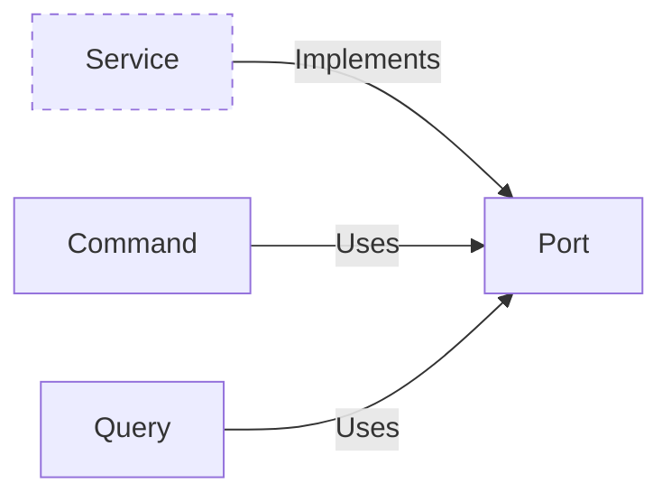

import { Tabs } from "nextra/components"

# Ports



Ports are one of the key components that facilitate the separation of concerns, making systems more modular and adaptable.

- **Interaction Points**: Serve as the primary points of interaction between the application's core logic and the outside world.
- **Abstractions**: Define abstract interfaces for the core application to communicate with external elements like databases, user interfaces, and external services.

## Implementing Ports

Ports are implemented as interfaces or abstract classes, depending on the programming language used.

<Tabs items={['Rust']}>
<Tabs.Tab>
```rust filename="application/src/port.rs" url=https://raw.githubusercontent.com/forgen-org/todo/ce9213676b2ebbd6532aed184f50fee13fd2684c/application/src/port.rs
```

</Tabs.Tab>
</Tabs>
