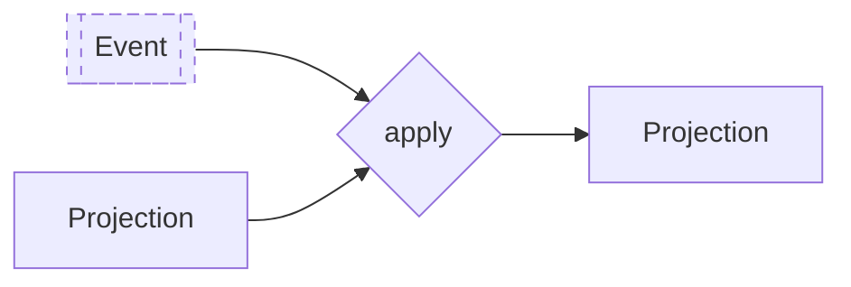

import { Tabs } from "nextra/components"

# Projections



Projections are used to create read models or views from the series of events or state changes that occur in the system. The role of a projection is to transform a state into a more readable or convenient format, often optimized for queries.

- **Data Transformation**: Projections transform event-sourced data (state changes) into a format suitable for querying and display.
- **Read Optimization**: They create read models optimized for performance and specific use cases.

## Implementation of Projections

<Tabs items={['Rust']}>
<Tabs.Tab>
```rust filename="application/src/projection.rs" url=https://raw.githubusercontent.com/forgen-org/todo/ce9213676b2ebbd6532aed184f50fee13fd2684c/application/src/projection.rs
```

</Tabs.Tab>
</Tabs>
