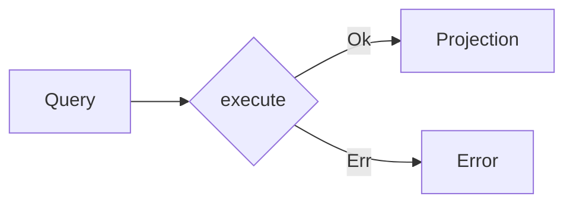

import { Tabs } from "nextra/components"

# Queries



Queries are about requesting and retrieving data without affecting the system's state. They don't interact with the domain. Queries are read-only operations and are used to fetch data for the application's read model. The update of the read model is handled by the commands.

- **Data-Focused**: Queries are solely concerned with data retrieval.
- **Side-Effect-Free**: They do not alter the state of the system.
- **Read-Oriented**: Queries interact with the read model of the application.

### Creating Queries

<Tabs items={['Rust']}>
<Tabs.Tab>
```rust filename="application/src/query.rs" url=https://raw.githubusercontent.com/forgen-org/todo/ce9213676b2ebbd6532aed184f50fee13fd2684c/application/src/query.rs#L5-L6
```

</Tabs.Tab>
</Tabs>

### Implementing Queries

Queries are usually implemented to interact with the read model, fetching data as per the application's requirements.

<Tabs items={['Rust']}>
<Tabs.Tab>
```rust filename="application/src/query.rs" url=https://raw.githubusercontent.com/forgen-org/todo/ce9213676b2ebbd6532aed184f50fee13fd2684c/application/src/query.rs#L8-L18
```

</Tabs.Tab>
</Tabs>
