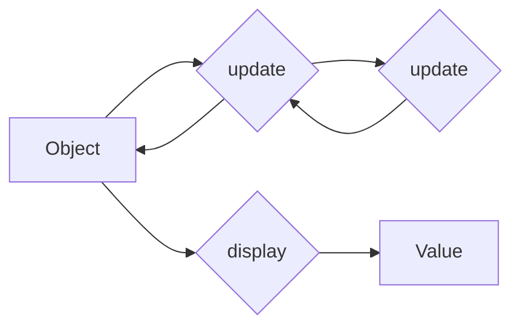

import { Tabs } from "nextra/components"

# Fluent Interfaces



OOP traditionally intertwines data and logic, creating potential issues with data manipulation and access, whereas FP, with its module-centric approach, risks name collision and can compromise integrity due to the independent nature of functional modules.

Fluent Interfaces allow for method chaining to create a more readable and concise API, which can help in mitigating the issues found in OOP and FP by providing a clear and efficient way to construct object instances without mixing data with logic and avoiding module conflicts and integrity breaches.

## How to Implement

<Tabs items={['Rust', 'Typescript']}>
<Tabs.Tab>
```rust file=<rootDir>/rust/src/fluent_interface.rs
```
</Tabs.Tab>
</Tabs>

## References

- [Fluent Interface - Martin Fowler](https://martinfowler.com/bliki/FluentInterface.html)
