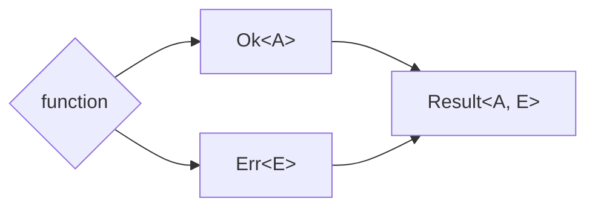

import { Tabs } from "nextra/components"

# Prefer Result Type over try-catch



## Context

In various programming languages, managing errors through exceptions, `try-catch`, or `throws` can obfuscate a function's behavior, making the code less predictable and harder to comprehend, as it's unclear whether, or what kind of, an exception will be thrown.

## Opinion

Given the context, we prefer using the `Result` type over `try-catch` or `throws` for error handling. `Result` types clearly indicate a function's outcome and encapsulate the value or error, enhancing code predictability and readability.

## How to Implement

<Tabs items={['Rust']}>
<Tabs.Tab>
```rust file=<rootDir>/rust/src/never_throw.rs
```
</Tabs.Tab>
</Tabs>
