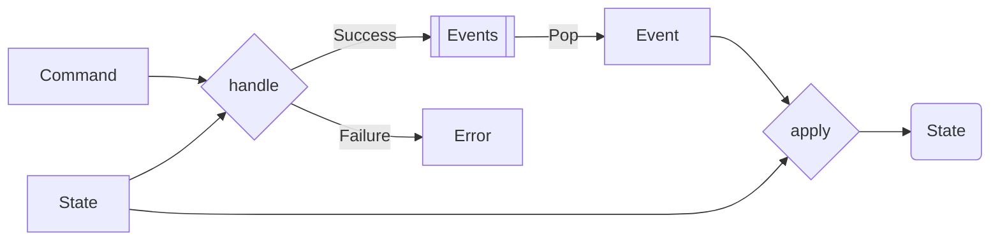

import { Tabs } from "nextra/components"

# Choosing Event Sourcing over State Mutation for Persistence



## Context

In traditional state mutation for persistence, the system's state is directly updated and overwritten in the data store. This makes it challenging to reconstruct past states or understand the history and reasons behind state changes. In contrast, event sourcing persists the state of a business entity as a sequence of state-changing events.

## Opinion

We advocate for using event sourcing as a persistence method over state mutation, as it offers enhanced traceability, auditability, and flexibility. With event sourcing, each state change is stored as a separate event, allowing for a comprehensive history of state transformations, easy debugging, and complex business logic support.

## How to Implement

<Tabs items={['Rust']}>
<Tabs.Tab>
```rust file=<rootDir>/domain/src/todolist_scalar.rs#L24-L37
```
</Tabs.Tab>
</Tabs>
