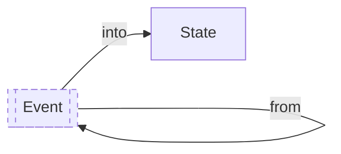

import { Callout } from "nextra/components"

# How to build Projections

**Date: 2023-12-27**



Consider a basic banking application with functionalities to deposit and withdraw funds:

```rs
pub enum BankAccountEvent {
    Deposited { amount: u32 },
    Withdrawn { amount: u32 },
}

pub struct BankAccountState {
    pub balance: u32,
}
```

The role of the `State` is to enforce one business rule: the balance cannot be negative. Its second role is to be stored as a snapshot to be retrieved without having to fetch all the past events.

Consider we want a simple `Projection` that sums the deposits and withdrawals. We cannot derive this `Projection` from the `State`. We would have to either change the `State` (which is forbidden because the domain should not depend on the application) or fetch all the events (which is what we tried to avoid in the first place by creating a state).

The application might want to have a "replay" feature to be able to rebuild the `State` or a `Projection` from scratch when there is an issue.

<Callout emoji="💡">
  We cannot generate a `Projection` from `State` thus we need `Projection =
  Projection + Event[]`.
</Callout>
