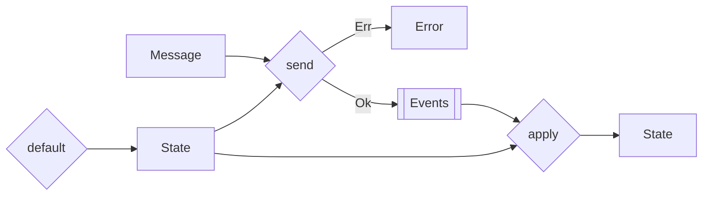
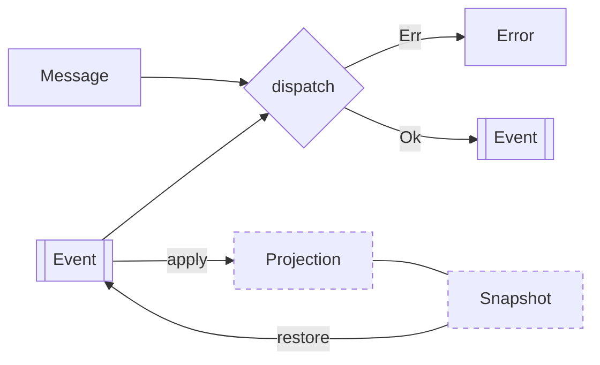

import { Callout } from "nextra/components"

# Simplifying Event Production in Event Sourcing

**Date: 2024-01-30**



Event sourcing in Rust often utilizes a pattern known as **State** or **Aggregate**, where state changes are represented through events. This process typically involves two key functions: `send` for generating events and `apply` for updating the state. However, this approach has its drawbacks:

<Callout type="error" emoji="️🚫">
  **Problem:** our **State** object resembles a **Projection** which is
  confusing. The role of a State should be to ensure the integrity of the domain
  model, not to represent it.
</Callout>

### Rethinking Event Handling

A fundamental question arises: Why do we need both `send` and `apply`? While `send` is crucial for validating business rules and producing events, `apply` mainly serves a technical purpose - to evolve and store the state so that we don't have to replay all events. As this is a technical requirement, this should not be part of the domain.

### Proposed Solution



### The Door Example

Consider a door's open/close mechanism. Each action (open/close) generates an event. The rule is simple: a door must be open to be closed and closed to be open. If we generates a lot of events over time, this can be become heavy to replay. We can simplify this by only looking at the latest event.

```rust
enum DoorMessage {
    Open,
    Close,
}

enum DoorEvent {
    Opened,
    Closed,
}

struct DoorSaga(Vec<DoorEvent>);

impl DoorSaga {
    fn is_open(&self) -> bool {
        self.0.last() == Some(&DoorEvent::Opened)
    }
}

impl DoorMessage {
    fn dispatch(&self, events: Vec<DoorEvent>) -> Result<Vec<DoorEvent>> {
        let saga = DoorSaga(events);
        match self {
            DoorMessage::Open => {
                if saga.is_open() {
                    Err("Door is already open")
                } else {
                    Ok(vec![DoorEvent::Opened])
                }
            }
            DoorMessage::Close => {
                if saga.is_open() {
                    Ok(vec![DoorEvent::Closed])
                } else {
                    Err("Door is already closed")
                }
            }
        }
    }
}
```

We introduce the concept of `Saga` to represent the state of our domain. It is a simple wrapper around a list of events. We can then use it to validate our business rules. The `dispatch` function is our `send` function (we renamed it not to be confused with the `Send` trait). It is responsible for validating the business rules and producing new events.

### Avoiding Events Replay

According to our previous example, we can conclude that we don't need to replay all events to determine the current state. We can simply look at the last event. We can create a **Snapshot** on the **Application** layer to represent it and store it in the database. In other words, we want: `Events -> Snapshot -> Events`.

```rust
struct DoorSnapshot {
    is_open: bool,
}

impl DoorSnapshot {
    fn apply(&self, event: DoorEvent) -> DoorSnapshot {
        match event {
            DoorEvent::Opened => DoorSnapshot { is_open: true },
            DoorEvent::Closed => DoorSnapshot { is_open: false },
        }
    }

    fn restore(&self) -> Result<Vec<DoorEvent>, ()> {
        if self.is_open {
            Ok(vec![DoorEvent::Opened])
        } else {
            Ok(vec![DoorEvent::Closed])
        }
    }
}
```

<Callout type="info" emoji="ℹ️">
  The `apply` function should remind you of the **Projection**. It is exactly
  the same! Thus, a **Snapshot** is actually a special case of a **Projection**
  (which might not be exposed to our end user).
</Callout>

#### Framework Support

```rust
pub trait Dispatch<Event, Error = AnyError> {
    fn dispatch(&self, events: &[Event]) -> Result<Vec<Event>, Error>;
}

pub trait Projection<Event> {
    fn apply(&mut self, events: &[Event]);
}

pub trait Snapshot<Event, Error = AnyError>: Projection<Event> {
    fn restore(&self) -> Result<Vec<Event>, Error>;
}
```
