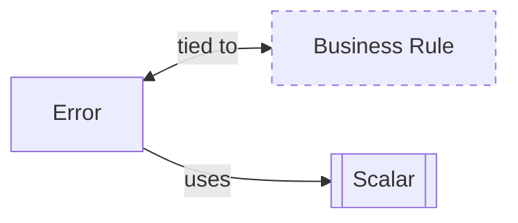

import { Tabs } from "nextra/components"

# Messages



**Errors** are not mere interruptions in the execution flow or technical glitches; they are considered as significant domain concepts that convey essential information about the business process. These errors can range from simple validation failures to complex business rule violations, each carrying context-specific information critical to the understanding and resolution of issues.

## Creating Errors

Errors represent violation of business rules. They should have meaningful names and be as descriptive as possible.

<Tabs items={['Rust']}>
<Tabs.Tab>
```rust filename="domain/src/todolist_error.rs" url=https://raw.githubusercontent.com/forgen-org/todo/ce9213676b2ebbd6532aed184f50fee13fd2684c/domain/src/todolist_error.rs
```

</Tabs.Tab>
</Tabs>
