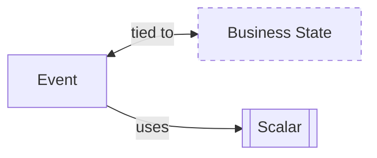

import { Tabs } from "nextra/components"

# Events



**Events** represent the sequence of state-changing events allowing for a comprehensive history of state transformations, easy debugging, and complex business logic support.

- **Auditability**: Records every change, ensuring full traceability.
- **Replayability**: Enables state reconstruction, aiding in debugging and analysis.
- **Scalability**: Efficiently manages high loads through decoupling.
- **Resilience**: Recovers state post-failure from the event log.
- **Insightful Data**: Offers deep insights through historical analysis.
- **Real-World Alignment**: Domain events mirror real-life business processes.

## Creating Events

Events should be the representation of real domain events. You should define them by talking to a domain expert or using techniques like [event storming](https://en.wikipedia.org/wiki/Event_storming). In our banking example, an event could be a deposit or a withdrawal.

Because events will be stored in a database, they should be serializable. In Rust, you can use the `serde` crate to derive the `Serialize` and `Deserialize` traits.

<Tabs items={['Rust']}>
<Tabs.Tab>
```rust filename="domain/src/todolist_event.rs" url=https://raw.githubusercontent.com/forgen-org/todo/ce9213676b2ebbd6532aed184f50fee13fd2684c/domain/src/todolist_event.rs
```

</Tabs.Tab>
</Tabs>
