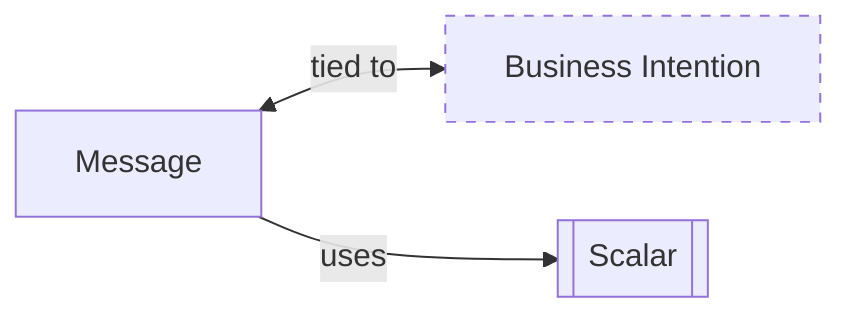

import { Tabs } from "nextra/components"

# Messages



In event-sourced systems, **messages** play a pivotal role in driving behavior. They act as the catalyst for state changes, adhering strictly to business rules. Messages are essentially actions or commands sent to the system's state. Their primary function is to validate and process these actions according to the defined business logic.

- **Actions to State**: Messages represent actions directed at the system's state.
- **Business Rule Enforcement**: They are responsible for ensuring that all interactions adhere to the established business rules.
- **Event Generation or Error Handling**: Upon processing, a message will either result in the generation of events or an error, contingent on the business rule validation.

The message-handling mechanism is integral to maintaining the integrity and consistency of the system. By encapsulating business logic, messages ensure that the state transitions are valid, logical, and traceable. This approach not only enhances the system's reliability but also provides a clear audit trail for every state change.

## Creating Messages

The message is the input to the system, and the event is the output. Messages are often mirrors of events. For example, if we have an event called `AmountWithdrawn` we might have a message called `WithdrawAmount`. This might not always be the case, for example we might have a message `UpdateBankAccount` that can produce multiple events, such as `CountryChanged` and `DescriptionUpdated`. Unlike events, it is totally okay to change messages as the system evolves as they are not used to reconstruct the state nor stored.

<Tabs items={['Rust']}>
<Tabs.Tab>
```rust filename="domain/src/todolist_message.rs" url=https://raw.githubusercontent.com/forgen-org/todo/ce9213676b2ebbd6532aed184f50fee13fd2684c/domain/src/todolist_message.rs
```

</Tabs.Tab>
</Tabs>
