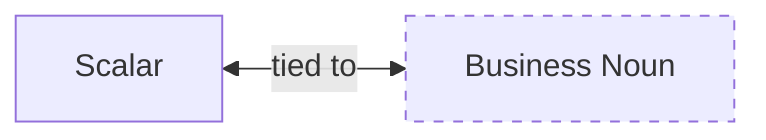

import { Tabs } from "nextra/components"

# Scalars



**Scalars** are the basic building blocks of a domain model. They are the primitive types that represent the data in your domain. They are the nouns of your domain model. They can have business rules attached to them.

They should be implemented using the [Newtype pattern](../best-practices/newtypes).

## Examples of Scalars:

- `Email`: Represents an email address, ensuring it meets specific format requirements.
- `JobTitle`: Encapsulates the concept of a job title within the organization.
- `NonEmptyString`: Guarantees that the string is not empty.
- `PositiveInteger`: Represents an integer, ensuring it is positive.
- `UserId`: Uniquely identifies a user within the system.

## Defining a Scalar

<Tabs items={['Rust']}>
<Tabs.Tab>
```rust filename="domain/src/todolist_scalar.rs" url=https://raw.githubusercontent.com/forgen-org/todo/ce9213676b2ebbd6532aed184f50fee13fd2684c/domain/src/todolist_scalar.rs#L24-L25
```

</Tabs.Tab>
</Tabs>

In this snippet, TaskName is a new type encapsulating a String. It represents the name of a task in a to-do list application.

## Implementing Business Logic

<Tabs items={['Rust']}>
<Tabs.Tab>
```rust filename="domain/src/todolist_scalar.rs" url=https://raw.githubusercontent.com/forgen-org/todo/ce9213676b2ebbd6532aed184f50fee13fd2684c/domain/src/todolist_scalar.rs#L27-L37
```

</Tabs.Tab>
</Tabs>

Here, the `try_from` method enforces a business rule for the `TaskName`: it cannot be empty. If an empty string is provided, an error is returned, thus ensuring that every task has a meaningful name.
