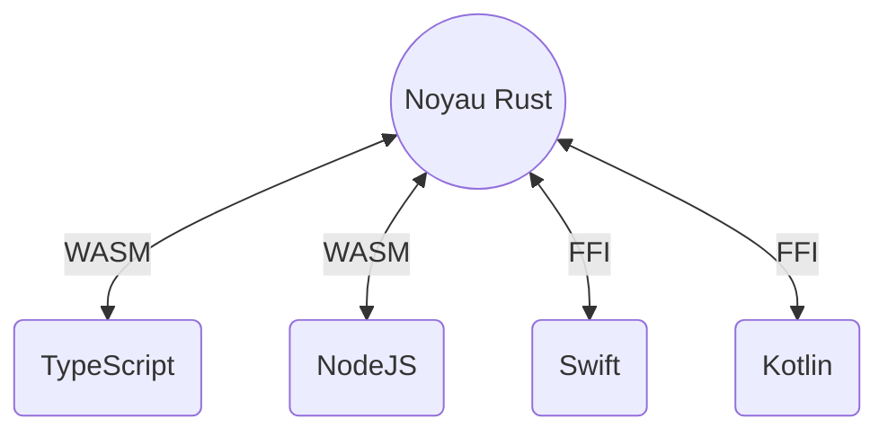

import { Animation, Jumbotron, Hero, Highlight } from "components"

<Animation />

<Jumbotron>

# Forgen

Concevoir des Solutions Multi-Plateformes.

</Jumbotron>

<Hero>
<Hero.Primary>
## Solution Multi-Plateforme

Notre cœur en Rust, enrichi de liaisons avec JavaScript, Swift et Kotlin, permet une philosophie <Highlight>coder une fois, déployer partout</Highlight>. Expérimentez une performance inégalée sur toutes les plateformes.

[Demander un Devis](mailto:hello@forgen.tech)

</Hero.Primary>
<Hero.Secondary>

</Hero.Secondary>
</Hero>

<Hero>
<Hero.Secondary>

</Hero.Secondary>
<Hero.Primary>
## Technologie de Pointe

Tirant parti des dernières avancées en Rust, WebAssembly et TypeScript, nous offrons une performance et une stabilité inégalées. Notre engagement envers les technologies modernes garantit une évolutivité et une expérience sans bugs pour vos projets.

[Notre GitHub](https://github.com/forgen-org)

</Hero.Primary>
</Hero>

<Hero right>
<Hero.Primary>
## Artisanat et Qualité

Notre passion pour l'excellence nous motive. Composé uniquement de développeurs seniors, Forgen est synonyme d'artisanat. Nous livrons des logiciels de la plus haute qualité, minutieusement conçus pour répondre à vos besoins précis.

[Notre Architecture](/fr/learn/introduction)

</Hero.Primary>
<Hero.Secondary>

</Hero.Secondary>
</Hero>

<Hero>
<Hero.Secondary>

</Hero.Secondary>
<Hero.Primary>
## Notre Manifeste

Nous adhérons à un ensemble strict de valeurs morales. Honnêteté, transparence et engagement envers la qualité nous définissent. Nous nous réservons le droit de choisir des projets alignés sur notre manifeste, garantissant que notre travail reflète nos normes éthiques élevées.

[En savoir plus](/fr/manifesto)

</Hero.Primary>
</Hero>

<Hero right>
<Hero.Primary>
## Communauté et Ouverture

Forgen est plus qu'une entreprise ; nous sommes une communauté. Notre engagement envers l'ouverture et le partage de connaissances est inébranlable. Des contributions open-source aux discussions engageantes sur notre chaîne Discord et des articles de blog perspicaces, nous croyons en la force de la transparence.

[Rejoignez-nous sur Discord](https://discord.gg/6fTK3ssg)

</Hero.Primary>
<Hero.Secondary>

</Hero.Secondary>
</Hero>
