import { Tabs } from "nextra/components"

# Commands

```mermaid
flowchart LR
  Command
  Nothing["∅"]
  Error
  execute{execute}

  Command --> execute
  execute --Ok--> Nothing
  execute --Err--> Error
```



Commands describe an intent to change the system's state. They have side-effects and interact with the write model. They are used to encapsulate application logic and are often used to implement use cases. They don't return a value, but they can fail.

- **Intent-Driven**: Commands represent a clear intention to change the system's state.
- **Action-Oriented**: Unlike queries, which request data, commands perform actions that modify state.
- **Task-Specific**: Each command is designed for a specific operation, ensuring clarity and purpose.

## Creating Commands

It is recommended to create a command for each application use case.

<Tabs items={['Rust']}>
<Tabs.Tab>
```rust filename="application/commands.rs"
#[derive(Debug, Deserialize)]
pub struct TransferAmountCommand {
  amount: f64,
  from: String,
  to: String,
}
```
</Tabs.Tab>
</Tabs>

## Implementing Commands

<Tabs items={['Rust']}>
<Tabs.Tab>
```rust filename="application/commands.rs"
use framework::*;

#[async_trait]
impl<R> Command<R> for TransferAmountCommand
where
R: BankAccountStore + Send + Sync
{
async fn execute(&self, runtime: &R) -> AnyResult<()> {
// Get accounts state from the store
let from_account = runtime
.get_account(&self.from)
.await?;

    let to_account = runtime
      .get_account(&self.to)
      .await?;

    // Send messages and produce events
    let from_events = BankAccountMessage::Withdrawal(self.amount);
    let to_events = BankAccountMessage::Deposit(self.amount);

    // Push events to the write model
    runtime.push_events(&self.from, from_events).await?;
    runtime.push_events(&self.to, to_events).await?;

    Ok(())

}
}

```
</Tabs.Tab>
</Tabs>

## Updating Projections
```
