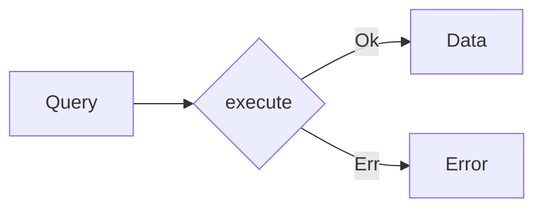

import { Tabs, Tab } from "nextra/components"

# Queries



Queries are about requesting and retrieving data without affecting the system's state. They don't interact with the domain. Queries are read-only operations and are used to fetch data for the application's read model. The update of the read model is handled by the commands.

- **Data-Focused**: Queries are solely concerned with data retrieval.
- **Side-Effect-Free**: They do not alter the state of the system.
- **Read-Oriented**: Queries interact with the read model of the application.

### Creating Queries

<Tabs items={['Rust']}>
<Tab>
```rust filename="application/queries.rs"
#[derive(Debug, Deserialize)]
pub struct GetAccountBalanceQuery {
    account_id: String,
}
```
</Tab>
</Tabs>

### Implementing Queries

Queries are usually implemented to interact with the read model, fetching data as per the application's requirements.

<Tabs items={['Rust']}>
<Tab>
```rust filename="application/queries.rs"
use framework::*;

#[async_trait]
impl<R> Query<R> for GetAccountBalanceQuery
where
R: AccountReadModel
{
async fn execute(&self, runtime: &R) -> AnyResult<AccountBalance> {
runtime.get_account_balance(&self.account_id).await
}
}

```
</Tab>
</Tabs>
```
