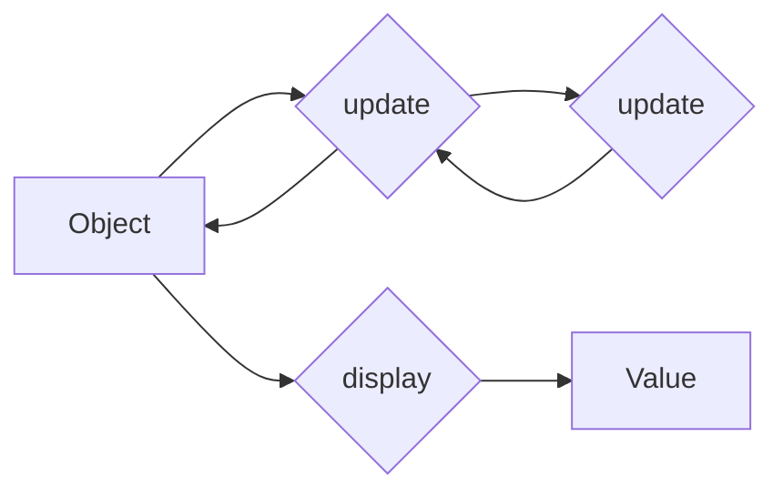

import { Tabs, Tab } from 'nextra/components'

# Adopting Fluent Interfaces over OOP and FP



## Context

OOP traditionally intertwines data and logic, creating potential issues with data manipulation and access, whereas FP, with its module-centric approach, risks name collision and can compromise integrity due to the independent nature of functional modules.

## Opinion

We decided to adopt Fluent Interfaces as our main design pattern. Fluent Interfaces allow for method chaining to create a more readable and concise API, which can help in mitigating the issues found in OOP and FP by providing a clear and efficient way to construct object instances without mixing data with logic and avoiding module conflicts and integrity breaches.

## How to Implement

<Tabs items={['Rust', 'Typescript']}>
<Tab>
```rust
// Data
struct User {
    name: String,
}

// Logic
trait UserTrait {
    fn change_name(&mut self, name: String) -> Self;
    fn say_hi(&self) -> ();
}

// Implementation
impl UserTrait for User {
    fn change_name(&self, name: String) -> Self {
        User { name: name.to_string() }
    }
    
    fn say_hi(&self) -> () {
        println!("Hi {}!", self.name);
    }
}

let user = User { name: "John".to_string() };
user.change_name("James").say_hi();
```
</Tab>
<Tab>
```ts
// Data
type UserData = {
  name: string
}

// Logic
type User = UserData & {
  changeName: (name: string) => User
  sayHi: () => void
}

// Implementation
const User = {
  create: (data: UserData): User => ({
    ...data,
    changeName: (name) => User.create({ ...data, name }),
    sayHi: () => console.log(`Hi ${data.name}`),
  }),
}

const user = User.create({ name: "John" })
user.changeName("James").sayHi()
```
</Tab>
</Tabs>

## References

- [Fluent Interface - Martin Fowler](https://martinfowler.com/bliki/FluentInterface.html)
