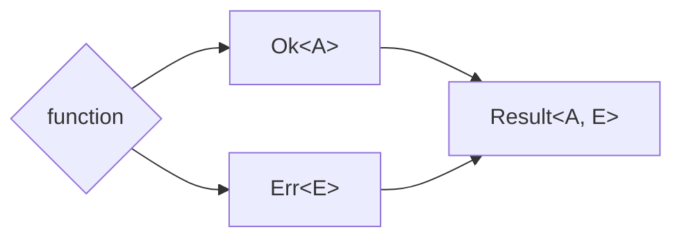

import { Tabs, Tab } from "nextra/components"

# Prefer Result Type over try-catch



## Context

In various programming languages, managing errors through exceptions, `try-catch`, or `throws` can obfuscate a function's behavior, making the code less predictable and harder to comprehend, as it's unclear whether, or what kind of, an exception will be thrown.

## Opinion

Given the context, we prefer using the `Result` type over `try-catch` or `throws` for error handling. `Result` types clearly indicate a function's outcome and encapsulate the value or error, enhancing code predictability and readability.

## How to Implement

<Tabs items={['Rust', 'Typescript']}>
<Tab>
```rust
// In Rust, the Result type is commonly used for error handling.

fn divide(numerator: f64, denominator: f64) -> Result<f64, String> {
if denominator == 0.0 {
Err("Cannot divide by zero".to_string())
} else {
Ok(numerator / denominator)
}
}

````
</Tab>

<Tab>
```ts
// In TypeScript, there is no built-in Result type, but we can create one.

type Result<A, E> = Ok<A> | Err<E>;

type Ok<A> = { _tag: 'Ok', value: A };
type Err<E> = { _tag: 'Err', error: E };

const Result = {
  ok: <T, E>(value: T): Ok<T> => ({ _tag: 'Ok', value }),
  err: <T, E>(error: E): Err<E> => ({ _tag: 'Err', error }),
}

function divide(numerator: number, denominator: number): Result<number, string> {
  if (denominator === 0) {
    return Result.err("Cannot divide by zero");
  } else {
    return Result.ok(numerator / denominator);
  }
}
````

</Tab>
</Tabs>
