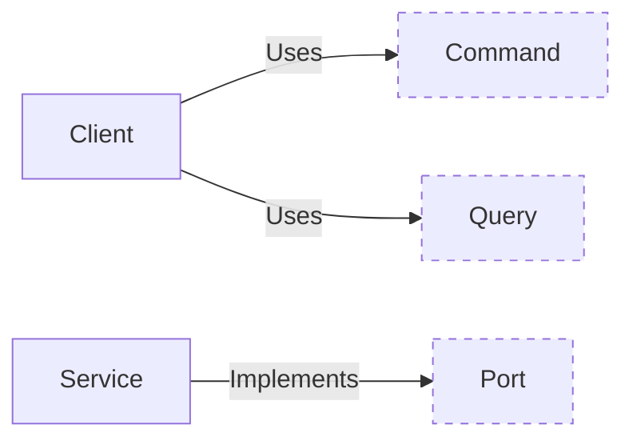

import { Callout } from 'nextra/components'

# Split of infastructure layer into clients and services

**Date: 2023-12-17**



Consider the development of a versatile chatbot application. Our chatbot is designed with a simple yet effective interface:

```rs
pub trait ChatBot {
    fn receive_message() -> Stream<MessageReceived>;
    fn send_message(event: &MessageSent) -> ();
}
```

This design, inspired by hexagonal architecture, efficiently separates input handling (`receive_message`) from output (`send_message`). Our goal is flexibility, catering to various platforms like Discord bots, command-line interfaces, or web applications.

Take the Discord bot as an example. It necessitates its own HTTP server for event listening, a requirement specific to its operation. To maintain our design's flexibility, we embed this HTTP server logic within the DiscordService itself, rather than the application layer.

As we expand to multiple platforms, each with its unique configurations and requirements, managing them becomes complex. This is where multi-clients architecture shines (similar to microservices). It allows us to deploy each client independently, with a centralized gateway efficiently handling different ports and routes.

<Callout emoji="💡">Splitting clients from services is not just a choice - it's a necessity for the seamless deployment and management of our diverse, multi-platform chatbot application.</Callout>
