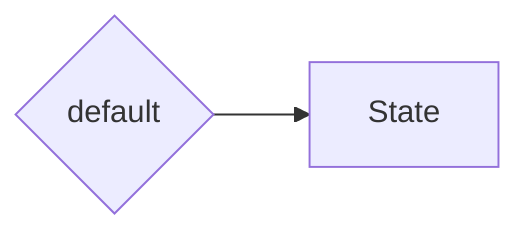

import { Tabs, Tab } from 'nextra/components'

# States



A **State** is a representation of a domain-specific object at a certain time. Its role is to ensure the business rules are respected and produce **Events**. It should have a default implementation, which is the initial value. It is okay to have placeholder values for the default implementation. You can also use `Option<T>` to represent a value that is not yet available.

- **Structure**: Primarily a straightforward object, characterized by its properties and data fields.
- **Evolution**: Capable of evolving over time with [events](events.mdx).
- **Non-Public Exposure**: Not intended for public access, hence capable of holding sensitive information.
- **Flexibility**: Adaptable in representing a wide range of domain-specific scenarios.
- **Meaningful**: its name and properties are intentionally descriptive and relevant to its domain.

## Creating States

We want to represent a bank account for a very simple banking application. A bank account has a balance, a description, and an owner. We will use the exact same words to have a loyal representation of the domain.

<Tabs items={['Rust']}>
<Tab>
```rust filename="domain/account_state.rs"
#[derive(Default, Debug)]
pub struct BankAccount {
    pub balance: f64,
    pub description: String,
    pub owner: Option<String>
}
```
</Tab>
</Tabs>

## Computing States

You can build a new state by applying a sequence of events to an initial state. This is called event replay. **This process cannot fail**, as the events are immutable and cannot be changed. Thus, you should not change the events after they have been created. If you really need to, you can do event upcasting, which is a process of converting an event to a new version of the event or migrating existing data to the new model.

<Tabs items={['Rust']}>
<Tab>
```rust filename="domain/bankaccount_event.ts"
use framework::*;

impl Events<BankAccount> for Vec<BankAccountEvent> {
  fn apply(&self, &mut state: BankAccount) {
    for event in self {
      match event {
        BankAccountEvent::Deposited(amount) => state.balance += amount,
        BankAccountEvent::Withdrawn(amount) => state.balance -= amount,
      }
    }
  }
}
```
</Tab>
</Tabs>


## Producing Events

Messages are processed with the state, which will either produce events or an error.

<Tabs items={['Rust']}>
<Tab>
```rust filename="domain/bankaccount_message.rs"
use framework::*;

impl Message<BankAccount> for BankAccountMessage {
  type Error = BankAccountError;
  type Events = BankAccountEvent;

  fn send(&self, state: &BankAccount) -> Result<Self::Events, Self::Error> {
    match self {
      BankAccountMessage::Deposit(amount) => {
        Ok(BankAccountEvent::AmountDeposited(*amount))
      }
      BankAccountMessage::Withdraw(amount) => {
        if *amount > state.balance {
          return Err(BankAccountError::NotEnoughFund);
        }
        Ok(BankAccountEvent::AmountWithdrawn(*amount))
      }
    }
  }
}
```
</Tab>
</Tabs>
