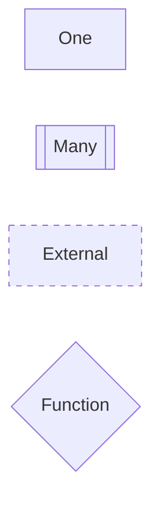

# Introduction

## Forgen's Proposition for a Clean/Hexagonal Architecture

Welcome to Forgen's proposition for a clean/hexagonal architecture using event-sourcing and CQRS in Rust and TypeScript. This architecture is designed with the intention of being utilized across all projects developed by Forgen.

Our architecture is built on the principles of Event-Sourcing and Command Query Responsibility Segregation (CQRS). Event-Sourcing ensures that all changes to application state are stored as a sequence of events. Not just can we query these events, we can also use the event log to reconstruct past states, and as a foundation to adjust the state to cope with new business requirements.

CQRS, on the other hand, separates read and write operations for a data store. This provides a more flexible architecture that can evolve over time and adapt to changing requirements.

The architecture is designed in Rust and TypeScript, two powerful and efficient languages that offer safety, speed, and concurrency. Rust's memory safety guarantees and TypeScript's static typing and easy-to-use syntax make them ideal for building robust, high-performance applications.

This architecture is not set in stone. It is open to criticism and evolution over time. We believe in continuous improvement and we understand that as new technologies and methodologies emerge, our architecture must adapt and evolve to stay relevant and efficient.

The architecture is built over a logical flow where all concepts derive from the previous ones in a rational manner. This ensures that the architecture is easy to understand and follow, making it easier for developers to work with.

We invite you to explore this architecture, provide your feedback, and join us in refining and improving it over time.

## Inspirations

- [Clean Architecture](https://blog.cleancoder.com/uncle-bob/2012/08/13/the-clean-architecture.html)
- [Hexagonal Architecture](https://alistair.cockburn.us/hexagonal-architecture/)
- [Event Sourcing](https://thinkbeforecoding.com/post/2021/12/17/functional-event-sourcing-decider)
- [CQRS](https://martinfowler.com/bliki/CQRS.html)
- [Functional Programming](https://en.wikipedia.org/wiki/Functional_programming)
- [Effect system](https://en.wikipedia.org/wiki/Effect_system)

## How to read diagrams?

