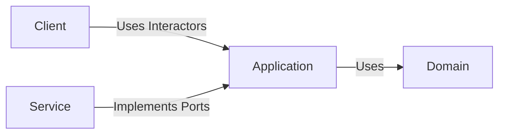
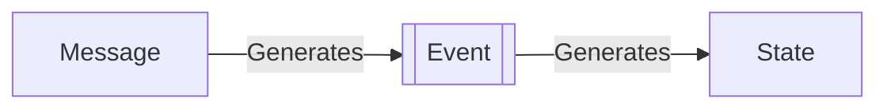
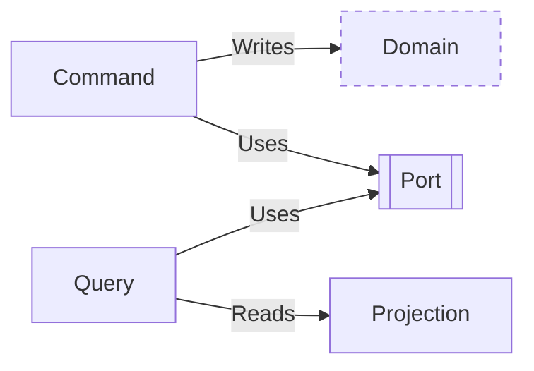
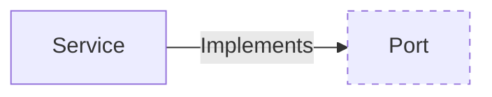
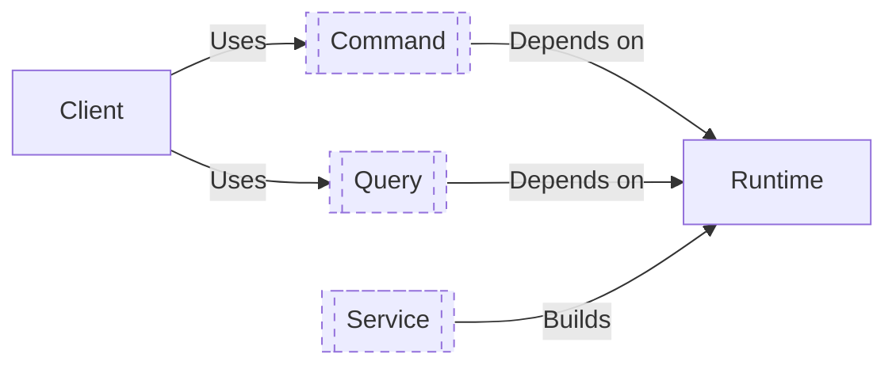

# Forgen Architecture: Key Concepts

The architecture is composed of four layers:

- **Domain**: The core logic and business rules of the application.
- **Application**: The flow of data and operations.
- **Services**: The driven adapters in the architecture.
- **Clients**: The driving adapters in the architecture.

## Domain Layer

The **Domain** layer represents the core logic and business rules of an application. It is the heart of the application's functionality and encapsulates the most fundamental principles that define what the application does. It represents the business rules as a domain expert would explain them without having to use programming terms.

- **Independent**: Relies minimally on external elements, primarily system crates.
- **Business Logic Centric**: Contains the business rules and logic specific to the domain of the application.
- **Standalone**: Designed to operate independently of the application's other layers.

## Application Layer

The **Application** layer is responsible for handling the flow of data and operations. It represents the application's core logic as a programming expert would explain them without having to use specific tools. This is the place for interactors and ports.

- **Commands and Queries**: Provides functions for the outside world to interact with the application's core logic.
- **Ports**: Exposes interfaces (ports) that define how external elements can interact with the application.

## Services Layer

**Services** are the driven adapters in the architecture. They realize the contracts defined by the application's ports, providing concrete functionalities.

- **Driven Adapters**: Implement the interfaces (ports) defined by the application layer.
- **Application Dependent**: Directly reliant on the application layer for defining their contracts and interfaces.

## Clients Layer

**Clients** refer to the driving adapters in the architecture. They utilize the interactors provided by the application layer to initiate and control workflows.

- **Driving Adapters**: Use the interactors exposed by the application layer to trigger and manage processes.
- **Application Layer Dependency**: Relies on the application layer's interactors for functionality.
